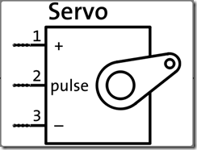

## Arduino入門教學(12) – 使用可變電阻控制伺服馬達 (作者：Cooper Maa)

### 實驗目的

練習用可變電阻控制伺服馬達(Servo motor)的旋轉角度。


### 材料

* 麵包板 x 1
* Arduino 主板 x 1
* 伺服馬達(Servo Motor) x 1
* 10k 可變電阻 x 1
* 單心線 x N

### 接線

伺服馬達有三條線，電源(紅線)、接地(黑線)，以及訊號線。



把伺服馬達紅線接到 +5v，黑線接到 GND，訊號線接到 pin 9
可變電阻中間腳位接到類比輸入(Analog Input) pin 0，剩下的兩支腳位，一支接到 5V，另外一支接到 GND


### 電路圖


### 程式碼

RC 伺服馬達(Radio Controlled Servo Motor) 大部份是透過 PWM (Pulse Width Modulation, 脈波寬度調變)來控制，Arduino 裏內建了 Servo Library 讓事情變得很簡單，就算你對 PWM 不熟，也可以很輕鬆地控制伺服馬達。底下的程式碼示範 Servo Library 的使用方法(Servo.pde):

```CPP
// 引用 Servo Library
#include <Servo.h> 
 
// 建立一個 Servo 物件
Servo myservo;
// 旋轉角度
int value = 0;
 
void setup() 
{ 
  myservo.attach(9);  // Servo 接在 pin 9
} 
 
void loop() 
{ 
  if (value == 0) 
    value = 180;
  else
    value = 0;
  
  // 叫 Servo 旋轉角度:
  //    myservo.write(0) 是叫 Servo 旋轉到 0 度的位置
  //    myservo.write(180) 是叫 Servo 旋轉到 180 度的位置
  myservo.write(value); 
  delay(1500);
} 
```

程式說明:

* L2: 引用 Servo library
* L5: 利用 Servo 類別建立 myservo 物件
* L24: 要控制 Servo 旋轉角度，只要呼叫 Servo 的 write() 並傳入指定的角度就可以了，例如 myservo.write(180) 是控制 Servo 轉到 180 度，myservo.write(120) 是控制 Servo 轉到 120 度。
使用可變電阻控制伺服馬達(PotServo.pde):

```CPP
// 使用可變電阻控制 Servo 的旋轉角度
// by Michal Rinott <http://people.interaction-ivrea.it/m.rinott> 

// 引用 Servo Library
#include <Servo.h> 

// 建立一個 Servo 物件 
Servo myservo; 
 
// 可變電阻接在 Analog pin 0 
int potpin = 0;
// 儲存旋轉角度的變數
int val;
 
void setup() 
{ 
  myservo.attach(9);  // Servo 接在 pin 9
} 
 
void loop() 
{ 
  val = analogRead(potpin);            // 讀取可變電阻(數值介於 0 到 1023)
  val = map(val, 0, 1023, 0, 179);     // 把 0 - 1023 的數值按比例縮放為 0 - 180 的數值
  myservo.write(val);                  // 設定 Servo 旋轉角度
  delay(15);                           // 等待 Servo 旋轉指定的位置
}
```

程式說明:

* L22: 讀取可變電阻並將讀到的數值(介於 0 到 0123)儲存在 val 變數中
* L23: 0 到 1023 的數值必須經過數值轉換，依比例轉為 0 到 180 的數值，因為我們的伺服馬達只能在 0 到 180 度之間旋轉。範例程式利用 map() 函式將 0 – 1023 的值對應到 0 -179。
* L24: 根據讀到的可變電阻值控制 Servo 轉到指定的角度

### 範例照片／影片

請參考 makezine.com 做的這個影片，影片除了示範伺服馬達的控制外，也講解了線路的接法以及程式碼：

* [YouTube: How-To Tuesday: Arduino 101 potentiometers and servos](http://youtu.be/FKj9jJgj8Pc)

### 延伸閱讀

* [Servo Motor control with Arduino](http://itp.nyu.edu/physcomp/Labs/Servo)
* [RC Servo 之 PWM 控制範例](http://www.embedded101.com/AnthonyLu/tabid/71/entryid/52/Default.aspx)
* [GWS 廣營電子](http://www.gws.com.tw/)
* [ServoMechanism](http://www.robives.com/mechs)

【本文作者為馬萬圳，原文網址為： <http://coopermaa2nd.blogspot.tw/2011/01/arduino-lab16.html> ，由陳鍾誠編輯後納入本雜誌】

