## 淺談動平均濾波器 (作者：黃俊傑)

### 簡介

動平均濾波器(moving average filter) 可說是世界上使用最廣泛的一種濾波器了;
在股市裡面,每天都可以看到動平均濾波器的應用,股價趨勢圖裡面的週線、月線與
年線, 都是長度不等的動平均輸出圖形。我們在實作訊號處理的時候, 也很常應用
這個簡單又有效率的動平均濾波器。由於它應用廣泛, 許多程式設計師也許沒有修
過數位訊號處理的課程, 不熟悉數位訊號處理分析方式, 但是又需要寫這樣的程式。
因此, 在這一篇文章中, 筆者將會儘量以實例來介紹動平均濾波器的概念, 幾種不同
的實作方式以及優缺點。

最直觀的動平均濾波器,當屬於simple moving average (SMA) 了, 也是應用在
股市以及很多統計上面的動平均。SMA的定義就是取目前輸入之前的N 個取樣的
非權重平均。用數學式表示的話, 就是

 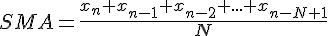 

或是在訊號處理上我們慣用以下的時域表示式

  

其中, y(n) 代表目前輸出值, 而x(n) 代表目前輸入值。這個濾波器應用在股市
裡, 就是我們在股票市場裡常常看到的曲線圖, 如週線、月線與年線, 分別是N=7,
N=30, N=365 的每日收盤價格的動平均輸出圖形。

使用濾波器來形塑(shape) 你的資料的目的, 通常都是為了要讓資料的重點能
夠呈現出來, 比方說, 股市的波動常常有一個快速變動的部份, 與慢速變動的部份,
而所謂的慢速變動的部份, 我們認為那是長期的趨勢, 是我們想要觀察的重點, 所以
將濾波器應用在每日收盤價格上, 將「快速變動的部份濾掉」, 保留慢速變動的部份,
就成了週線、月線與年線了。以數位訊號處理理論來說, 那些慢速變動就是指低頻
的部份, 快速變動的部份就是高頻的部份, 因此以數位訊號處理的術語來說, 動平均
濾波器就是一個低通濾波器(low pass filter), 意思就是低頻能夠通過的濾波器, 而
高頻的部份就被過濾掉了。又比方心跳表顯示每分鐘心跳率是用一個數值, 而我們
知道心跳每幾秒鐘記錄一次的話, 一分鐘裡面會有上上下下的變化, 不是一直維持
在某一個數值, 每分鐘心跳率就是一分鐘裡面心跳的平均數值, 以方便我們在心跳
表上顯示出來, 但是以每分鐘的平均數值顯示出來的時候, 如果你沒有很大的運動
變化, 每分鐘心跳率是維持在一個定值的。

### 常用動平均濾波器

在本節中, 我們會介紹四種常見的動平均濾波器, 前兩種動平均濾波器直接實作了
上一節所描述的SMA動平均濾波器,這兩種只有小部分的差異。而第三種是SMA
的變形, 引進了回授的概念來簡化實作的複雜度, 因此前三種廣義上都是SMA 動
平均濾波器的實作。第四種我們要介紹的是指數平均濾波器,與前三種不太一樣,但
是有著實作簡單的好處。

在定點訊號處理裡, 我們有兩種直接實作SMA 的方法, 第一種就如上一節中方
程式2 描述的式子, 先做加總, 再除以N 來得到結果。我們以N=4 為例子說明這個
濾波器, 其方程式會是:

 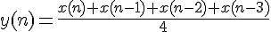 

假設我們觀察的是餐廳每半小時的顧客人數, 如表1 中的「輸入」欄位所示, 「輸
出」欄位所示的就是這個N=4的動平均濾波器的輸出序列,計算方式就是依照方程
式3, 以x(n) 為目前輸入, y(n) 為目前輸出值, 以輸入為20 那一欄為例, 這時候

  

表1: 餐廳每半小時顧客人數以及其動平均值

| 輸入 | 0 | 0 | 0 | 0 | 10 | 20 | 30 | 35 | 20 | 10 | 5 | 0 | 0 | 0 | 0 |
|------|---|---|---|---|----|----|----|----|----|----|---|---|---|---|---|
| 輸出 | 0.00 | 0.00 | 0.00 | 0.00 | 2.50 | 7.50 | 15.00 | 23.75 | 26.25 | 23.75 | 17.50 | 8.75 | 3.75 | 1.25 | 0.00 |

圖1 則是把這個輸出入關係繪製成圖形表示, 我們可以看出來, 當輸入發生變化的
時候, 輸出值會以延遲而且比較平緩的趨勢呈現, 延遲是因為動平均濾波器是計算
前N 個輸入, 而比較平緩的趨勢就是動平均濾波器對這個輸入值重塑後的結果。觀
察方程式3可以發現,有兩個輸入數列特別有趣,分別是+1, -1, +1, -1, +1, -1, ... 這
種正負交互出現而且絕對值是一樣的數列。把這個數列輸入到上述的方程式, 我們
會得到全為零的輸出。另一個有趣的數入數列是0, +1, 0, -1, 0, +1, 0, -1, ... 也就是
將上一個數列任兩個數值間都插入一個零值。於是這個數列就變成任意相鄰四個數
字加總起來為零,使得輸出值皆為零的數列。觀察這個兩個數列,第一個數列週期為
2, 第二個數列週期為4。而第一個數列,在數列的極大與極小值固定的情況下,變化
是最為劇烈的一組(或說週期最小), 也就是數位訊號能夠表示的最高頻率, 我們稱之為 Nyquist rate
, 或是取樣頻率。第二個數列, 其頻率則為取樣頻率的一半。

這個數位濾波器會讓這兩個頻率的輸入值產生全為零的輸出序列。另一個特殊的序列
就是全部都是定值的序列, 其變化頻率為零, 把這個序列輸入到這個數位濾波器, 可
以得到的輸出序列與輸入序列完全一致,數值大小也一樣。到這裡,讀者對這個簡單
動平均濾波器應該有一些概觀了。

接下來, 我們用z transform 來分析這個濾波器, 這一段落是參考, 不影響讀者
了解動平均濾波器的基本概念。我們只會用到最基本的z transform pair, 條列如下:

  

(註1 : z transform 是把時域表示式轉換成代數式以方便做分析的一個工具, 轉換之後, 就是用代數的方式來分析)

前一個段落的方程式其 z transform transfer 方程式是

 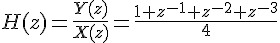 

其 z-plane 如圖2 所示, z-plane 就是把方程式4 的分子為零與分母為零的代數式,
分別求根,並繪製在圖上,注意z 是複數, z plane 就是複數平面。分子為零的根就用
小圓圈表示,稱為zero,或零點。而分母為零的根就用X表示,稱為pole,或極點。

(註2 : z plane, z transform, 以及頻率響應是數位訊號處理的分析方法, 如果有興趣, 可以參考數位訊號處理的書籍, 若不懂也不影響讀者了解這篇文章。)

在
這個z-plane 圖上有三個小圓圈,代表z transform 的分子  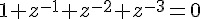  的解。
而這三個解剛好在半徑為1 的圓上。這個方程式的分母為4, 是一個常數, 所
以沒有poles. 而它的頻率響應則如圖3 所示, 是一個低通濾波器。注意圖3 中有Y
軸有兩個點會小到負無窮大的位置(如果Y 軸是linear scale 的話就是0), 分別是
 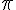  與  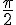  的位置, 這兩個位置一個是取樣頻率, 一個是取樣頻率的一半。對照剛剛舉
的特殊序列與頻率響應圖, 兩個讓輸出值為零的序列, 在頻率響應圖上Y 軸的值為
   , 而完全沒變化的數列, 輸出值的大小與序列都未被改變, 對應到頻率響應
圖上X=0的那一點,其大小為0 dB,轉換成線性數值就是 1. 

(註3 : dB 值是比率, 兩個振幅 A1 與 A2 的比率是 A1/A2 轉換成dB 值就變成  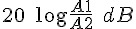  , 所以
0 dB 表示 A1/A2 = 1, 而    表示 A1/A2 = 0。)

(說明：X 軸是radian/sample, Y=-1 的點在  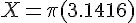  代表取樣頻率, 也就是這個數位濾波器的最高頻率, 與    的地方)

為避免讀者誤解,我必須提醒一下, 上述兩個數列不是三角波(雖然用直線連起來是三角波), 而是兩個表
現在數列上的正弦函數波, 如圖4 及圖5 所示。對數位訊號處理有涉獵的讀者, 應
該能夠從圖2 就直接看出圖3 的頻率響應吧。

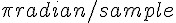  的正弦函數波取樣點](../img/AvgFig4.jpg)

  的正弦函數波取樣點](../img/AvgFig5.jpg)

這個實作的好處是我們只需要N 個加法器, 一個除法器, 以及N 個delay elements。缺點就是在做加總的時候,由於定點數值的表示欄位有限,數值可能會溢位,
而溢位會導致 saturation 或是 wrap-around, 前者只是動平均值稍微變小一點,還可
以接受, 後者就會造成整個數值的錯亂, 從一個極大值變成極小值。然而要做saturation 
需要額外的電路或動作, 有的時候, 硬體不一定能提供這個功能。因此, 為了
避免溢位的困擾, 就有另一種實作的方式, 就是先把每一個元素除以N, 然後才加
總起來, 這樣就完全不用考慮溢位的問題, 缺點就是運算量變成N 個除法器, 一個
加法器, 以及N 個delay elements. 上述兩個實作方式的除法器, 如果我們刻意取
 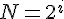  , i 是大於或等於零的整數, 亦即N 是2 的冪次方, 我們就可以把這些除法
器變成shifter, 可以進一步節省硬體成本, 而不影響結果。當然, 如果要實作週線圖
的話, 我們就沒辦法將除法器變成shifter, 但是我們還是可以用乘法器來取代除法
器, 只要用小數( 1/N ) 當乘數就可以了。

第三種動平均濾波器是前兩種的變形, 前兩種在實作的時候, 總是要取前N 個
輸入值來相加, 但是每一次計算都只往前一個輸入值, 其中有N-1 個輸入值都是重
複計算的, 那麼運算上有更簡便的方法嗎? 答案是有的。同樣以N=4 為例, 計算如
下:

 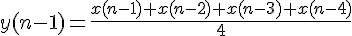 

  

 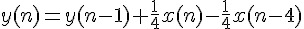 

因為上一筆輸出值 y(n - 1) 已經計算好了, 不需要重新計算, 所以只需要加上新增
的那一項  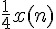  再減去舊的  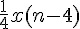  就可以得到這一筆的輸出值 y(n), 簡化計
算的次數。就可以用下列方程式描述:

  

以z transform 的觀點來看的話, 方程式2 中的動平均時域表示式的z transform 方程式如以下所示:

 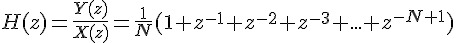 

如果我們對分子分母同乘  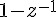  , 分子就可以化簡成  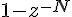  , 所以其z-transform equation 就會是

  

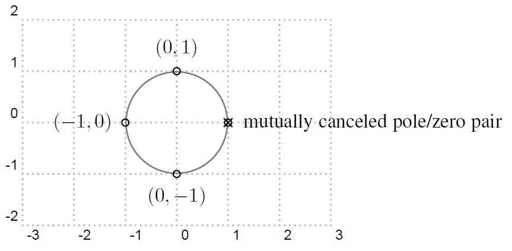

這個轉回時域表示式就是:

 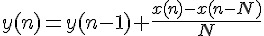 

上述的z-plane 圖會變成如圖 6 所示, 與圖 2 相比, 多了一個pole 在z = 1, 同時多了一個zero 在z = 1, 而位在z = 1 的zero/pole 互相抵消(因為兩者為同一個
因式, 且分布在分子與分母), 因此跟前二種濾波器的輸出是一樣的, 亦即頻率響應
圖也如圖3 所示。這一種的動平均濾波器的輸出與前兩者完全一樣,但是在實作上,
因為利用了回授的特性簡化了實作的複雜度, 整個實作需要的元件是一個N-tap 的
delay element, 一個1-tap 的delay element, 一個除法器或shifter, 兩個加法器。

第四種動平均濾波器比上述三種都來得更簡單, 稱為指數平均濾波器(exponential average filter), 或稱為 expoential averager, 不過在相同的輸入下, 它的輸出的
pattern 跟上述三種有些不同, 也就是頻率響應不一樣。其架構如圖7 所示, 時域的
式子是

  

z-transform equation 是

 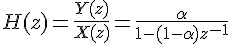 

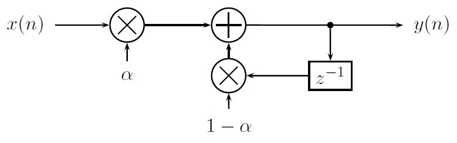

   是一個控制變數, 可以控制這個濾波器的頻率響應, 也可以控制指數平均濾波器
對於瞬間的變化, 需要多久時間才能夠追得上。從圖8 可以看出, 它有一個pole 在
   的地方, 也就是透過改變     的值來移動 pole 的位置, 達到控制頻率響應的目的。圖9 是當輸入為step function 的時候, 不同的     值的反應。   值愈小, 表
示目前的輸入值的權重愈小, 因此當輸入有大改變的的時候, 輸出追上的時間愈久,
但也代表愈不容易受高頻雜訊影響。反之,     值愈大,表示輸出值可以很快反應輸入
值的變化, 對於高頻雜訊的免疫力就下降了。

圖10a 及圖10b 分別是    以
及    的指數平均濾波器的頻率響應圖, 兩張圖比較一下可以看得出來    愈
大, 高頻的部份被衰減的愈少, 因此高頻容易通過。這個動平均濾波器是非常簡單,
但又提供了不錯的效率, 實作時不論所需要的頻率響應為何(亦即不同的     值), 都
只需要兩個乘法器, 一個delay element, 以及一個加法器就可以, 這點與簡單動平
均濾波器相比,就是一個很顯著的優點。通常在實作的時候,我們喜歡把     取  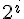  , 這
樣就可以把乘法器變成 shifter, 可以用更簡單的運算量來實作。這個濾波器比較不
適合要觀察瞬間變化趨勢的地方, 比如說股價趨勢, 但是應用在只需要觀察長時間
平均值的地方, 比如說每分鐘心跳數的平均, 汽車或腳踏車的速度計, 這倒不失為一
個簡單實作又有效率的濾波器。

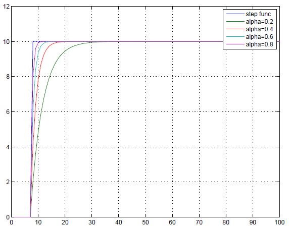

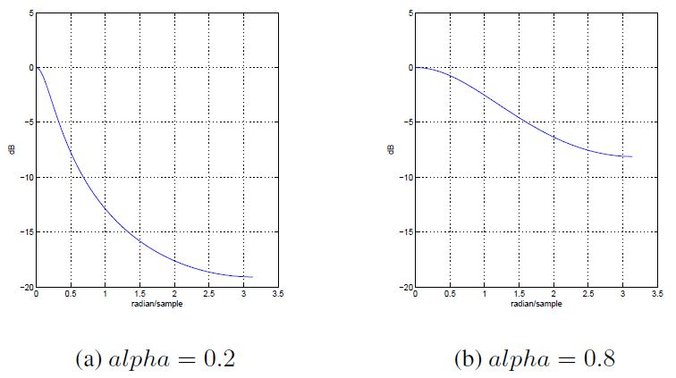

### 結語

由於動平均濾波器在統計、訊號處理與股市的廣泛應用, 我們身為程式設計師一定
有機會接觸到。而且目前全球定位系統或是感測器資料非常容易取得, 全球定位系
統的定位資料或是感測器每次感測的數值會受大氣等等環境的干擾使得資料產生
亂數的偏移, 這些都可以透過平均來消除這些干擾, 是個非常實用的技巧。

然而並非所有程式設計師都修習過數位訊號處理的理論, 因此, 筆者試圖以最少的理論介紹動平均濾波器的概念, 其中介紹了四種濾波器, 前三種屬於簡單動平均濾波器的
濾波器, 第四種屬於指數平均濾波器。前三種屬於簡單動平均濾波器的濾波器裡面,
第一種是最直觀實作的, 不過因為重複計算多, 運算量最大, 第二種則是第一種的小
變形, 在定點運算的時候, 減少溢位的發生機會, 如果讀者是用浮點運算來實作, 那
麼第一種與第二種是完全一樣的。第三種則是簡化版的簡單動平均濾波器, 筆者建
議如果要實作簡單動平均濾波器的話,以第三種來實作,可以大幅簡化運算量。第四
種指數平均濾波器則比前三種更為簡單, 運算量也最少, 尤其是把乘法器以shifter
取代之後, 在沒有浮點運算的處理器上, 更是如魚得水。不過, 指數平均濾波器比較
適合應用在變動較不頻繁的資料上, 這點讀者要注意。

希望這篇文章能夠讓各位在寫程式處理會亂飄動的資料的時候, 能夠知道有動平均濾波器這種武器可以使用,
使得處理這一類資料能夠更穩定。

最後, 謝謝各位耐心的把這篇文章看完!

(本文作者 黃俊傑之 email 為 <jiunjie.huang@gmail.com> ，寫於 May 24, 2013，原文為 latex 格式，由陳鍾誠編輯後納入程式人雜誌)

