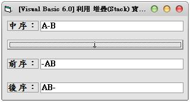
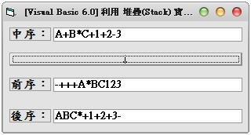

## [Visual Basic 6.0] 利用 堆疊(Stack) 實作中序轉前序與後序 (作者：廖憲得 0xde)






```Monobasic
Dim Stack() ' 建立一個堆疊
Dim StackTop ' 堆疊頂端指標

Private Sub StartInFo_Click()
'-----中序轉後序-----
ReDim Stack(Len(Text1)) ' 堆疊大小為整串大小 (避免出錯)
StackTop = 0 ' 堆疊初始化
Text3 = "" ' 一開始將輸出清空

For i = 1 To Len(Text1) ' 一個一個字抓直到結束
    Select Case Mid(Text1, i, 1)
        Case "(" ' 放入堆疊中
            StackPush (Mid(Text1, i, 1))
        Case ")"
            ' 拿出來直到等於 "("
            Do Until Stack(StackTop) = "("
                Text3 = Text3 & StackPop
            Loop
                StackPop
        Case "+", "-" ' 如果堆疊頂端的權值大於等於讀入的值則先讀出 => "+","-","*","/"
            Do Until Stack(StackTop) <> "+" And Stack(StackTop) <> "-" And Stack(StackTop) <> "/" And Stack(StackTop) <> "*"
                Text3 = Text3 & StackPop
            Loop
            StackPush (Mid(Text1, i, 1))
        Case "*", "/" ' 如果堆疊頂端的權值大於等於讀入的值則先讀出 => "*","/"
            Do Until Stack(StackTop) <> "*" And Stack(StackTop) <> "/"
                Text3 = Text3 & StackPop
            Loop
            StackPush (Mid(Text1, i, 1))
        Case Else ' 除了括號或運算元直接放入
            Text3 = Text3 & Mid(Text1, i, 1)
    End Select
Next i

Do Until StackTop = 0 ' 將堆疊中的全部拿出來
    Text3 = Text3 & StackPop
Loop


'-----中序轉前序-----
ReDim Stack(Len(Text1)) ' 堆疊大小為整串大小 (避免出錯)
StackTop = 0 ' 堆疊初始化
Text2 = "" ' 一開始將輸出清空

For i = Len(Text1) To 1 Step -1 ' 從最後面開始做做到最前面,輸出也是從後面放到前面
    Select Case Mid(Text1, i, 1)
        Case ")" ' 放入堆疊中
            StackPush (Mid(Text1, i, 1))
        Case "(" ' 拿出來直到等於 ")"
            Do Until Stack(StackTop) = ")"
                Text2 = StackPop & Text2
            Loop
                StackPop
        Case "+", "-" ' 拿到直接讀入的值 <= 堆疊頂端的值
            Do Until Stack(StackTop) <> "*" And Stack(StackTop) <> "/"
                Text2 = StackPop & Text2
            Loop
            StackPush (Mid(Text1, i, 1))
        Case "*", "/"
            StackPush (Mid(Text1, i, 1)) ' 直接放入
        Case Else ' 除了括號或運算元直接放入
            Text2 = Mid(Text1, i, 1) & Text2
    End Select
Next i

Do Until StackTop = 0 ' 將堆疊中的全部拿出來
    Text2 = StackPop & Text2
Loop
End Sub

Function StackPush(Inp) ' 放入堆疊
    StackTop = StackTop + 1
    Stack(StackTop) = Inp
End Function

Function StackPop() ' 從堆疊中讀出
    StackPop = Stack(StackTop)
    Stack(StackTop) = ""
    StackTop = StackTop - 1
End Function
```

* 原始碼下載： [Visual Basic 6.0 中序轉前序與後序.rar](http://files.dotblogs.com.tw/0xde/1311/2013111884738284.rar)

【本文作者為「廖憲得」，原文網址為： <http://www.dotblogs.com.tw/0xde/archive/2013/11/18/130093.aspx> ，由陳鍾誠編輯後納入本雜誌】
