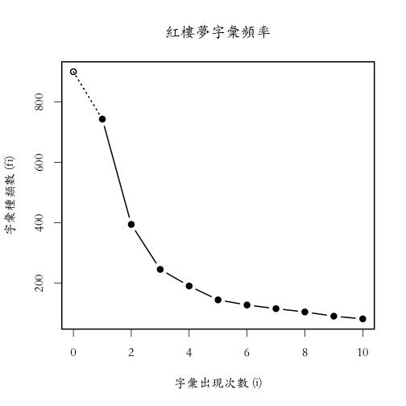
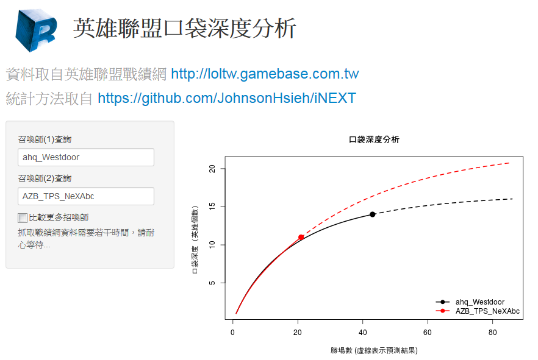

## R 講題分享 - 種類數的估計與預測

### 簡介

關於一個集合內部種類數的估計問題，在各種領域中廣泛的討論。譬如：戶政機關的人口數估計、流行病學中的罹病人數估計、生態學中的物種數估計、程式設計中的臭蟲數估計、考古學中的器皿數估計、古典文學中的作家字彙數估計等等。任職於清華統計所的 [趙蓮菊](http://chao.stat.nthu.edu.tw/) 教授是國際間研究種類數估計的大師，本文將簡單的介紹趙教授關於種類數估計問題所發展的統計方法。

### 研究問題與資料格式

為了得知集合中的種類數，勢必透過抽樣資料來估計。本文舉李蕙帆 (2008) 對於曹雪芹先生所撰寫的經典名著紅樓夢做為例子，假定欲探討的集合為文學大家曹雪芹先生所認識的字彙，則紅樓夢前80回 (一般認為120回的紅樓夢，前80回為曹雪芹所作，後40回為他人續作) 可視為曹先生認識字彙的抽樣結果，下表為種類數調查數據的基本格式，即曹雪芹在紅樓夢前80回的用字頻率，fi 表示小說中出現i次的字彙數目：

i | 1 | 2 | 3 | 4 | 5 | 6 | 7 | 8 | 9 | 10 | 10up 
------|-----|-----|-----|-----|-----|-----|-----|-----|-----| --- | --------- 
   | 743 | 394 | 245 | 190 | 144 | 127 | 115 | 104 | 90 | 81 | 1182


### Chao1 下界估計量

我們用 [R軟體](http://www.r-project.org/) 將上述表格繪製成以下示意圖，實心圓圈為樣本中出現    次字彙的調查結果    ，而空心圓圈表示樣本中未出現的字彙數，其值未知並記為    。令    表示曹雪芹認識字彙的總數，    表示樣本中出現的字彙數，則以上常數滿足關係式

  

因此，對於總字彙數    的估計問題，可以等價於未知常數    的估計。


```r
fau <- cbind(1:10, c(743, 394, 245, 190, 144, 127, 115, 104, 90, 81))
par(lwd = 2, pch = 19, cex = 1.3)
if (Sys.info()["sysname"] == "Darwin") par(family = "STKaiti")
plot(fau, type = "b", main = "紅樓夢字彙頻率", xlab = "字彙出現次數 (i)", 
    ylab = "字彙種類數 (fi)", xlim = c(0, 10), ylim = c(80, 900))
lines(c(0, 1), c(900, 743), lty = 3)
points(0, 900, pch = 1, lwd = 2)
```


趙教授 (Chao, 1984) 的研究發現未出現的物種數    與出現次數較稀少的物種 (    ) 息息相關，在已知樣本數為    之下，證明出以下不等式

  

其中符號    表示對隨機變數    取期望值。倘若    夠大，則種類數的 Chao1 估計量為

  

此外，由不等式的結果可知Chao1估計量必然小於等於真值，等號成立在每一種物種出現機率均相等的情況之下。經由若干計算得    ，也就是說至少會應用 4116 種字彙，就可以當一個偉大的文學家(笑)。


### 種類數的累積曲線

要知道，樣本中出現的種類數和抽取的樣本數息息相關。一般而言樣本數越大，則樣本中被觀察到的種類數也越多。如何經由少數的樣本來預測再次進行更多的調查時，種類數累進的多寡也是相當重要的議題。所謂的種類數累進曲線，可以區分成兩個部分，小於參考樣本點的種類數內插，以及大於參考樣本點的種類數外插。Colwell et al. (2012) 將種類數依據樣本數的內插與外插分析方法稱作稀釋與預測曲線 (Rarefaction and extrapolation curve)，並綜合前人的研究整合出曲線的估計方法。

種類數的稀釋與預測曲線可以透過Hsieh et al. (2013) [即本篇文章的第一作者] 所開發的R套件[iNEXT](https://github.com/JohnsonHsieh/iNEXT) (iNTerpolation and EXtrapolation) 進行計算。這裡介紹兩筆實際資料的應用：傳染病資料、英雄聯盟戰績資料。

第一筆資料取自於[衛生福利部疾病管制署](http://www.cdc.gov.tw/) 所提供的[2013年傳染疾病監測數據](http://www.cdc.gov.tw/list.aspx?treeid=1F07E8862BA550CF&nowtreeid=053A772AE8E9C869)做為例子，該數據提供2012, 2013年每週法定傳染病之確定病例數以及累計確定病例數。取2013年第20週的累計確定病例數據為參考樣本，該筆資料包含6210筆確定病例、35種法定傳染病。詳細的R指令如下所示，首先利用R套件[devtools](http://cran.r-project.org/web/packages/devtools/)安裝放置在[github](http://github.com/)上的[iNEXT](https://github.com/JohnsonHsieh/iNEXT)開發中版本。讀入筆者擷取自原始資料的.csv檔後，利用iNEXT()函數計算樣本數(確定病例人數)從1至15000的種類數，即法定傳染病數目。其中黑色實心圓圈表示第20週 (week20) 之樣本數與種類數的位置，黑色實線為種類數的內插、虛線為外插，淺色區域為95%信賴區間。而紅色X則是在第1, 5, 15, 20, 30, 44週的真實調查結果。透過本例的分析，可以發現利用前20週的病例資料進行稀釋與預測曲線分析不僅可以驗證前5週與15週的傳染病種類數結果，同時也準確的估計往後30週與44週的傳染病種類數。


```r
# library(devtools) install_github('iNEXT','JohnsonHsieh')
library(iNEXT)
dat <- read.csv(url("http://dl.dropboxusercontent.com/u/26949459/2013%E5%82%B3%E6%9F%93%E7%97%85.csv", 
    encoding = "big5"), row.names = 1)
Sobs <- apply(dat, 2, function(x) sum(x > 0))
n <- apply(dat, 2, function(x) sum(x))

out <- iNEXT(dat$week20, datatype = "abundance", end = 15000)
par(lwd = 2, pch = 19, cex = 1.3)
plot.iNEXT(out, main = "Rarefaction/extrapolation at week20")
points(n, Sobs, col = 2, pch = 4, cex = 1.5, lwd = 2)
text(n, Sobs, colnames(dat), col = 2, pos = 1, cex = 1)
```




第二個例子取自線上資料庫[英雄聯盟戰績網](http://loltw.gamebase.com.tw/) 所提供召喚師在5v5的積分(團隊和個人)和一般遊戲中獲勝過的場次使用的英雄記錄。這個分析利用R套件Shiny (關於Shiny的介紹可以參見**[R 講題分享 – 利用 R 和 Shiny 製作網頁應用](http://programmermagazine.github.io/201309/htm/article6.html)** 這篇刊載於程式人2013年9月號的文章)以及iNEXT製作成 [英雄聯盟口袋深度分析](http://glimmer.rstudio.com/wush978/LOLChampion/) 的線上分析App供所有英雄聯盟的召喚師(玩家)使用。該App利用種類數的累積曲線計算每位召喚師戰鬥勝場數與使用英雄數目的關連曲線，有助於玩家本身或者是電競團隊追求更好表現的參考。




### 結語

筆者在此展示了三種截然不同領域 (紅樓夢字彙資料、法定傳染病資料、電競遊戲資料) 的資料分析，主要用意在於說明種類數分析在各種領域中均有其重要性 (分析完這些資料也可以自稱是古典文學家、流行病學家甚至是電競專家了XDDD)。雖然本文在介紹方法的過程中省略的數學推導的過程，不過其背後主要的概念其實只是用到[柯西-施瓦茨不等式](http://zh.wikipedia.org/wiki/%E6%9F%AF%E8%A5%BF-%E6%96%BD%E7%93%A6%E8%8C%A8%E4%B8%8D%E7%AD%89%E5%BC%8F)以及[均值定理](http://zh.wikipedia.org/wiki/%E4%B8%AD%E5%80%BC%E5%AE%9A%E7%90%86)，有興趣的朋友可以參閱文獻：Chao (1984)、Sanders (1968) 與Shen et al. (2003)。


### 參考文獻
- Chao, A. 1984. Nonparametric estimation of the number of classes in a population. Scandinavian Journal of Statistics 11:265-270.
- Colwell, R. K., A. Chao, N. J. Gotelli, S. Y. Lin, C. X. Mao, R. L. Chazdon, and J. T. Longino. 2012. Models and estimators linking individual-based and sample-based rarefaction, extrapolation and comparison of assemblages. Journal of Plant Ecology 5:3-21.
- Sanders, H. L. 1968. Marine benthic diversity: a comparative study. American Naturalist 102:243-282.
- Shen, T. J., A. Chao, and C. F. Lin. 2003. Predicting the number of new species in further taxonomic sampling. Ecology 84:798-804.

### 作者

#### T.C. (Johnson) Hsieh ([euler96@gmail.com](mailto:euler96@gmail.com))
- 清華統計所博士(2009-2013)，致力於發展沒人懂的統計方法與開發沒人用的統計軟體
  * [Taiwan R User Group](https://www.facebook.com/Tw.R.User) Officer
  * [Data Science Program](http://datasci.co/) 籌備委員
- R 相關著作：
  * R套件，[CARE1](http://cran.r-project.org/web/packages/CARE1/)主要作者
  * R套件，[iNEXT](http://github.com/JohnsonHsieh/iNEXT)主要作者
  * Shiny應用，[iNEXT-Online](http://glimmer.rstudio.com/tchsieh/inext/)
- 研究領域：Statistics, ecology and genetics
