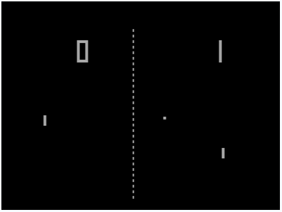

## 歷史短訊：電玩遊戲的歷史

對於台灣的五年級 (民國 50 年代出生) 的朋友們而言，可能很多人都玩過那種小型的掌上遊戲機，
但是大部分的人可能不瞭解這類電動遊戲的歷史，在本期的程式人雜誌當中，我們會將焦點放在遊戲
與其相關產品的歷史介紹上。

### 1950 年代

電玩遊戲起源於 1950 年代，Thomas T. Goldsmith Jr. 與 Estle Ray Mann兩人是第一位申請遊戲機專利者，
描述了一個用了八顆真空管以模擬飛彈對目標發射，包括使用許多旋紐以調整飛彈航線與速度的遊戲裝置，
但是當時的顯示技術還不夠成熟，結果只好改用單層透明版畫當目標，所以這個遊戲機不太好用。

1951年，英國的 Christopher Strachey 寫出了西洋跳棋程式，1952年劍橋大學的 A.S. Douglas 發展出了
一個稱為《OXO》井字棋遊戲。1958年 William Higinbotham 利用示波器與類比電腦創造出了《雙人網球》遊戲。

### 1960 年代

1961年，美國的 Steve Russell 等學生，於麻省理工學院的一部 DEC PDP-1 電腦中寫了一個名為《宇宙戰爭》
（Spacewar!）的遊戲。後來這款遊戲還在早期的網際網路上發售。因此 Spacewar 被認為是第一個廣為
流傳及具影響力的電子遊戲。

1966年，Ralph Baer 發明了一個在標準電視上顯示的簡單電子遊戲：《追擊》（Chase）。
後來並幫助 Bill Harrison 一起製造了光線槍並於1967年與 Bill Rusch 共同開發了幾個電子遊戲。1968年他們發展出一個具有桌球及射擊等不同遊戲的原型機。

1969年，C 語言發明人之一的 Ken Thompson 寫了一個在 Multics 系統上運行的《太空旅行》
（Space Travel）遊戲。後來 Ken Thompson 改用 PDP-7 撰寫，結果寫著寫著就創造出了 UNIX 作業系統，
而《太空旅行》也就成了 UNIX  的第一個應用程式。

### 1970 年代

1971年9月，模仿《宇宙戰爭》的初代小蜜蜂遊戲（Galaxy Game）被安裝在史丹福大學的一個學生活動中心裏。
是第一個投幣式電子遊戲，而且該機器只有建造一部。

1971年， Nolan Bushnell 與 Ted Babney 建造了《宇宙戰爭》的投幣式街機版本，稱為《電腦空間》。
後來 Nutting Associates 取得該遊戲授權並大量製造了 1500 部，於 1971 年 11 月發行。
雖然該遊戲因各種困難而不太成功，但卻樹立了標竿，成為第一個大量製造並供商業銷售的電子遊戲。

有了上述的經驗， Nolan Bushnell 與 Ted Babney 兩人乾脆攜手於 1972 年創立了 Atari 公司，
並於同一年內就創造出 《乓》（Pong）這款遊戲，而且大獲成功，總共賣了19,000 部，以下是 Pong 這個遊戲
的畫面，或許您曾經玩過也說不定。

1977年，Atari發行了名為 Video Computer System (VCS) 卡匣為主的遊戲機，後來改稱Atari 2600，
設計了9款遊戲並在假期季節發行。它迅速成為所有早期遊戲機當中最受歡迎的一款。

後來日本開始踏進遊戲工業，1978年日本 TAITO 公司開發出的《太空侵略者》（Space Invaders）大賣，
遊戲產業開始進入美日兩國相互競爭的年代。

1979 年的小精靈《Pac-Man》第一個在主流文化上廣受歡迎，並且是第一個遊戲角色以其自己本身形象
獲得大眾肯定的遊戲。

### 1980 年代

街機黃金年代在1980年代到達了頂峰，很多在技術或類型上革新的遊戲在80年代前幾年紛紛出現。

《3D怪物迷宮》（3D Monster Maze，1981年）是家用電腦上的第一個三維遊戲，而《戴格拉斯地下城》（Dungeons of Daggorath，1982年）則再添加了各種類型的武器與怪物、細緻的音效、和一個「心跳」的血條。《一級方程式賽車》（Pole Position，1982年）。

1980年發行的《魔域》更進一步地使文字冒險遊戲在家用電腦上流行起來，並確立了開發商Infocom在這類型遊戲上的優勢。

1982年8月，Commodore 64公開發行。它因為強勢行銷與優越價位造成其一開始就賣得火紅。

1983年 SuperSet Software公司創造了《狙擊》（Snipes）這個文字模式的網路電腦遊戲，並在新的IBM PC架構下的電腦網路測試、展示遊戲功能。

1984年一個真正的現代冒險遊戲隨著雪樂山《國王密使》系列誕生。

BBS 在1980年代十分流行，因此有時被用來當作線上遊戲進行的平台。許多玩家透過 BBS 進行遊戲。遊戲類型從文字冒險到賭博遊戲如廿一點等。也有多人遊戲像是 MUD (Multi-User Dungeons） 等等，這些遊戲最終進化成今日眾所週知的 MMORPG（大型多人在線角色扮演遊戲）。

任天堂的 Game &Watch 生產線在 1980 年開始生產 LCD 可攜遊戲機。 後來很多廠商也開始做。它們的體積很小，有些可以像手錶一樣可載在手腕上。

電腦遊戲市場於 1984 年取代了家用機市場。1985年，北美的電子遊戲市場因任天堂在亞洲外被稱為任天堂娛樂系統（Nintendo Entertainment System，縮寫為NES）的8位元FC遊戲機(任天堂紅白機）的發行而復甦。該機隨機銷售《超級瑪利歐》，立即大賣。在新遊戲機裏，手柄取代了搖桿、旋鈕及keypad成為系統所包括的預設遊戲操縱器。一個備8個方向的指向柄（Directional-pad, D-pad）和2個或以上的行動鍵的手柄設計成為了當時的標準。

1986年《勇者鬥惡龍系列》第一部《勇者鬥惡龍 I》發行，在日本文化上造成有史以來的奇蹟，又稱國民RPG。

### 1990 年代

1990年代三維電腦圖像，伴隨著透過音效卡與光碟機的「多媒體」能力升級。1992年即時戰略遊戲（RTS）沙丘魔堡II發行。它當然絕不是該類型遊戲第一炮（許多其他遊戲足以被稱為非常原始的RTS，請參見即時戰略遊戲歷史），不過它為後來的票房RTS遊戲如魔獸爭霸、終極動員令、與星海爭霸定下了這類遊戲的標準技巧。

1990年代Maxis開始發行它成功的《模擬XX系列》，從《模擬城市》（Sim City）開始，以其它不同的變種作為延續，如《模擬地球》（Sim Earth）、《模擬城市2000》（Sim City 2000）、《模擬螞蟻》（Sim Antz）、《模擬大樓》（Sim Towers）及2000年推出、後來燴炙人口的日常生活模擬器──《模擬人生》（The Sims）。

1996年，隨著3dfx的Voodoo晶片上市，引領了第一個個人電腦上使用的平價3D加速卡。第一人稱射擊遊戲（如有名的《雷神之錘》）是其中第一個利用這新技術的。

任天堂64沿用了卡匣而非CD-ROM，此舉帶來了較高的成本並引起遊戲廠商的不滿。值得一提的是，史克威爾把之前由任天堂家機平台獨佔的《最終幻想》系列轉給了PlayStation；1997年《最終幻想VII》的巨大成功，使 PlayStation成為該類遊戲的主要平台，並帶動RPG的流行。

1998 年投入市場的Dreamcast，開啟了此世代的大門，但其銷路不佳，隨後在後繼機種出現前就淡出市場，SEGA 因此撤退到第三方遊戲開發市場。索尼以PlayStation 2 開啟新的紀元，該機器日後成為目前為止銷售最佳的家用機。

### 2000 年之後

在2001年年終之前，視窗作業系統暨專業生產力軟體巨擘微軟，挾家用機市場成熟與世嘉和任天堂的衰頹，以Xbox切入電子遊戲業。

隨著價廉物美的寬頻網際網路連線在全球普及，許多出版商轉向時間計費線上遊戲，作為一種創新嘗試。大型多人在線角色扮演遊戲（MMORPG）號召了許多作品的賣座，如《魔獸世界》（World of Warcraft）與《最終幻想XI》（Final Fantasy XI）。此類遊戲主打PC市場，Xbox透過其內建的網路介面分了一杯羹。而PS2與GameCube缺乏上線能力，兩者後來都有這類連網附加週邊發行，但反響效果不如xbox live。

2005年任天堂的 Wii Remote 成功的將手握型遙控體感裝置帶入家庭遊戲的領域，成為新一代家庭遊戲機的典範。

2010年，微軟推出了 Kinect 改用身體當作體感裝置，搶食了 Wii 的市場。

接著、蘋果推出的 iPad 大受歡迎，讓平板遊戲開始快速發展，整個世界進入了行動娛樂的新時代 .....

### 參考文獻
* [電子遊戲歷史](http://zh.wikipedia.org/wiki/%E9%9B%BB%E5%AD%90%E9%81%8A%E6%88%B2%E6%AD%B7%E5%8F%B2)
* [History of video games](http://en.wikipedia.org/wiki/History_of_video_games)

【本文由陳鍾誠取材並修改自 [維基百科]，採用創作共用的 [姓名標示、相同方式分享] 授權】

